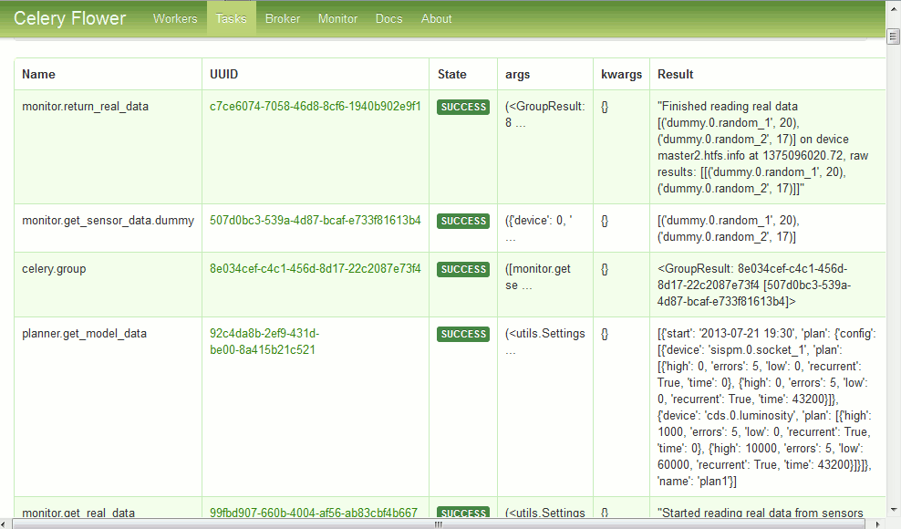

.. Robotice documentation master file, created by
   sphinx-quickstart on Sat Sep  6 10:33:57 2014.
   You can adapt this file completely to your liking, but it should at least
   contain the root `toctree` directive.

Welcome to Robotice's documentation!
====================================

.. toctree::
   :maxdepth: 2

.. automodule:: robotice.conf
   :members: Settings, RoboticeSettings, Grains, setup_app

.. automodule:: robotice.reasoner
   :members: compare_data, process_real_data 

Show me in action !
-----

First steps
===========

  :doc:`Overview <intro/overview>` |
  :doc:`Supervisor <intro/supervisor>` |

Indices and tables
==================

* :ref:`genindex`
* :ref:`modindex`
* :ref:`search`
